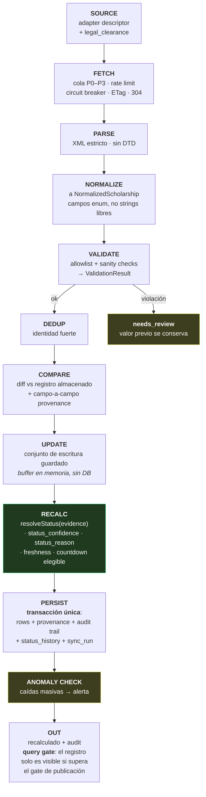
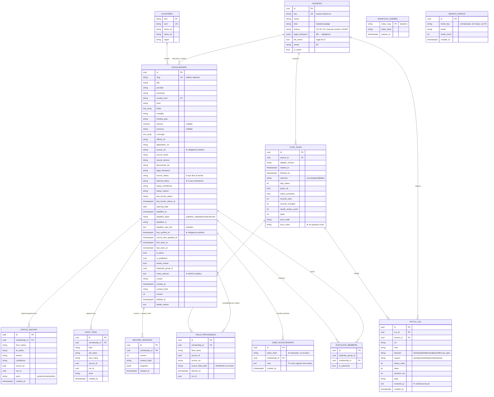
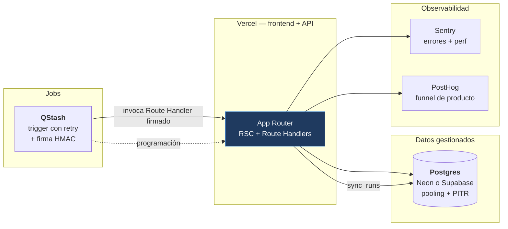

# FASE 3 — Architecture

> **Contexto del repo al elaborar este documento:** solo `docs/`. Sin `package.json`, sin `src/`, sin esquema, sin configuración de despliegue. Rama `master`, cero commits.
> **Entradas leídas íntegro:** `discovery.md`, `value-impact.md`, `legal-matrix.md`, `security-baseline.md`.
> **Stack** tratado como *inferencia del plan aprobado*, no como requisito verificado en el repo.
> ⚠️ **Hallazgo que cambia una decisión de infraestructura:** Vercel Functions no ofrece control de egress, por lo que el bloqueante SSRF #2 queda en manos de la capa de aplicación. Resuelto en §11.3 — requiere decisión explícita del usuario por su coste.

## 1. Requisitos y NFR (trazabilidad explícita)

### 1.1 Requisitos funcionales que la arquitectura debe servir

| # | Requisito | Origen | Restricción arquitectónica derivada |
|---|---|---|---|
| RF-1 | Búsqueda + facetas sobre datos verificados | `discovery §3.1.2` | Postgres FTS + índice GIN; sin motor externo de búsqueda en MVP |
| RF-2 | Estado de 6 valores, función pura | `discovery §4.3`, D4 | `resolveStatus()` sin I/O,Dependency-free, tabla de evidencia exhaustiva |
| RF-3 | `source_url` + `last_verified_at` obligatorios para publicar | `discovery §4.2` | **Restricción `CHECK` en Postgres**, no solo validación de aplicación |
| RF-4 | `UNKNOWN` con motivo y verificación preservada | `discovery §4.5` | El motivo es un campo persistido; el countdown se anula en render |
| RF-5 | Shortlist anónima con URL compartible | `discovery §3.1.6`, D5 | Token **hasheado** en BD; slug aleatorio para el enlace público |
| RF-6 | Página de metodología con métricas M3–M7 | `discovery §3.1.7`, D6 | Read-model dedicado que **excluye `is_demo`** |
| RF-7 | Monitoreo de frescura y decaimiento | `discovery §3.1.8` | `last_verified_at` por registro + agregación por `source_id` |
| RF-8 | 1 adapter automatizado + curación manual | `discovery §5.2`, D2 | Un solo `SourceAdapter` en MVP; curación entra por la **misma tubería de validación** |
| RF-9 | Anti-abuso sin ruta de pago ni lenguaje "garantizado" | `discovery §3.1.10`, D9 | Sin pasarela, sin features de afiliación; copy en componentes, no en datos |

### 1.2 NFR no funcionales

| NFR | Objetivo | Cómo lo garantiza la arquitectura |
|---|---|---|
| NFR-SSRF | Crítico | Frontera de fetch como **puerto con cliente vinculado** (§6, §10.1) |
| NFR-XSS | Alto | Render solo-texto + CSP estricta + Trusted Types + allowlist de serialización |
| NFR-Integrity | Alto | `resolveStatus` puro + guardas de campos + audit trail append-only + `needs_review` |
| NFR-Trazabilidad | Alto | Provenance por campo + `content_hash` + `version` + `status_history` |
| NFR-Disponibilidad | Medio | Postgres es el único SPOF de datos; lecturas servibles desde caché pública |
| NFR-Coste | Medio | Sin Redis, sin motor de jobs, sin embeddings en MVP |
| NFR-Observabilidad | Medio | Sentry (errores/perf) + PostHog (producto) + `sync_runs`/`fetch_log` (salud de datos) |

### 1.3 Clasificación: verificado / inferencia / por confirmar

| Elemento | Estado |
|---|---|
| Fuentes permitidas, veredictos legales, 54 URLs auditadas | ✅ **Verificado** (`legal-matrix`, 2026-09-30) |
| RSS EACEA working, da la URL oficial del programa, sin PII | ✅ **Verificado** (RSS parseado el 2026-09-30) |
| RSS es feed de *delta acotado* (~25 ítems, mezcla `Legacy`), **no export completo** | ✅ **Verificado** — cambia la arquitectura de datos (§4.4) |
| Vercel + Neon/Supabase + QStash + Upstash + Sentry + PostHog | 🔶 **Inferencia** del plan, no verificada en repo |
| Que ≥300 registros reales se alcacen por curación manual | 🔶 **Pregunta abierta Q1** sin resolver |
| Que el feed de delta cubra suficiente refresco para mantener 300 registros | 🔶 **Abierto Q3** — riesgo R2 arquitectónico (§13) |
| Vercel sin control de egress | 🟡 **Conocido de plataforma, a confirmar** contra el plan de red actual |

---

## 2. Restricciones arquitectónicas no negociables (derivadas de §6.3)

Estas 8 condiciones dejan de ser checklist de lanzamiento y **se hornean en el diseño**. Una decisión posterior que las viole es un defecto, no un ajuste pendiente.

| # | Bloqueante §6.3 | Restricción de diseño |
|---|---|---|
| B1 | Allowlist exacta, sin comodines | URLs **solo en el registro de endpoints**, validadas al cargar el módulo. Nunca construidas desde datos |
| B2 | Chequeos SSRF de IP resuelta + rebinding | Resolver → validar *todas* las A/AAAA → **fijar la conexión a la IP validada** con SNI/Host correctos |
| B3 | Límites de scheme, content-type, tamaño, timeout | Configurados **por adapter**, obligatorios: sin valor, el adapter no carga |
| B4 | robots.txt, UA con contacto, rate limit, concurrencia, circuit breaker, ETag | Config en el descriptor del adapter; el cliente vinculado los aplica, no el adapter |
| B5 | Guardas de integridad | Allowlist de enums, sanity checks, provenance, `needs_review`, audit trail, dedupe conservador |
| B6 | Chequeo legal/política | Bloque `legal_clearance` obligatorio en el descriptor; sin él, el adapter no se monta |
| B7 | Owner + logging de decisiones de fetch | `fetch_log` append-only con `decision` + `reason` en **cada** intento |
| B8 | Credenciales por fuente, cifradas, con owner | Sin credenciales en MVP; si aparece, almacén dedicado, nunca env global |

> **Consecuencia estructural clave:** B1+B2 implican que **ningún componente por encima de la capa de fetch puede causar una petición de red**. Eso no se consigue con disciplina, se consigue con la estructura de módulos de §6.

---

## 3. Puntos únicos de fallo (SPOF) identificados

| SPOF | Impacto | Mitigación arquitectónica |
|---|---|---|
| **Postgres** | Pérdida total de producto | PITR + snapshot diario + backup restaurado **probado** (no solo configurado); el corpus es reconstruible solo parcialmente → el backup es el activo crítico |
| **El único adapter (EACEA RSS)** | Si EACEA cambia el XML, cae el100% del descubrimiento automatizado | Contrato del parser versionado; feed → delta, no fuente de verdad; el corpus curado a mano sobrevive a la caída |
| **El curador humano** | Cuello de botella único para el gate de300 registros | Field `curator` obligatorio + registro de revisión; el ritmo es la métrica de riesgo R5 |
| **El límite de egress** | Si se degrada a "solo aplicación", el control anti-SSRF es reutilizable por error | Frontera de fetch encapsulada como puerto → subir de nivel sin tocar adapters |
| **La allowlist de serialización** | Fuga de `notes_internal`/`needs_review` a cualquier consumidor | Mapper explícito por tipo de respuesta + test que falla si un nombre de campo interno aparece en cualquier respuesta |
| **La región de Vercel ↔ región de Postgres** | Latencia y coste; potential cold-start de conexión por función | Postgres con connection pooling gestionado; agrupar escrituras en el sync, nunca por request |
| **El cron de sync** | Degradación silenciosa → todo estado se vuelve suposición | `sync_runs` + alerta M7 (§4.6); M7 es la métrica que detecta "el sistema parece vivo y no lo está" |

---

## 4. Diagramas C4

> Sintaxis `flowchart` en lugar de `C4Context`/`C4Container` (beta en Mermaid) para garantizar renderizado en GitHub, VS Code y mkDocs sin plugin.

### 4.1 L1 — Context

```mermaid
flowchart TB subgraph humans["Personas"]
    U1["<b>U1 · Lucía</b><br/>estudiante, móvil<br/>sin login"]
    U2["<b>U2 · Kwame</b><br/>profesional, desktop<br/>compara financiación"]
    U3["<b>U3 · Dra. Ana</b><br/>PhD, investiga<br/>exige funding desglosado"]
    U4["<b>U4 · Patricia</b><br/>asesora<br/>riesgo reputacional"]
    CUR["<b>Curador</b><br/>humano, con nombre<br/>escribe el corpus semilla"]
  end

  SYS["<b>Plataforma de becas verificables</b><br/><i>Un dataset trazable, no el agregador más grande.</i><br/>Cada registro: fuente oficial + fecha de verificación<br/>y admite lo que no sabe"]

  subgraph ext["Sistemas externos"]
    SRC["<b>Fuente automatizada</b><br/>EACEA Erasmus Mundus RSS<br/>CC BY 4.0 · verificado"]
    OFF["<b>Fuentes oficiales</b><br/>páginas de programas/consorcios<br/><i>solo lectura por el usuario</i>"]
    WEB["<b>Navegador del usuario</b><br/>destino del enlace oficial"]
  end

  subgraph ops["Operación del producto"]
    OBS["<b>Observabilidad</b><br/>Sentry · PostHog"]
 end

  U1 & U2 & U3 & U4 -->|"buscan, filtran, verifican,<br/>guardan en shortlist anónima"| SYS
  SYS -->|"enlace oficial prominente"| WEB
  WEB -->|"el usuario confirma en la fuente"| OFF
  SYS -->|"1 GET/ía, allowlist exacta"| SRC
  CUR -->|"registro + source_url + verified_at"| SYS
  SYS -.->|"errores, funnel, salud de datos"| OBS

  classDef sys fill:#1f3a5f,stroke:#4a90d9,color:#fff
  classDef ext fill:#3d2f1f,stroke:#d9a04a,color:#fff
  classDef hum fill:#2f3d1f,stroke:#8fbc4a,color:#fff
  class SYS sys
  class SRC,OFF,WEB ext
  class U1,U2,U3,U4,CUR hum
```

**Límite del sistema (declarado, no implícito):** la plataforma **no** automatiza cuentas de solicitantes, **no**Stored applicant data, **no** accede a portales tras login, **no** reproduce prosa de terceros.

### 4.2 L2 — Container

```mermaid
flowchart TB
  subgraph edge["Borde de red — sin estado, cacheable"]
    CDN["CDN / Edge Cache<br/>solo catálogo público<br/>Cache-Control explícito"]
  end

  subgraph app["Next.js App Router — frontend + API (Vercel)"]
    WEBAPP["<b>Web (RSC)</b><br/>search · detail · metodología<br/>badge is_demo obligatorio"]
    RH["<b>Route Handlers</b><br/>/api/search · /api/scholarships/*<br/>/api/shortlist/*<br/>allowlist de serialización"]
    SER["<b>Serializers (DTO)</b><br/>mapper campo-a-campo<br/>prohíbe SELECT * hacia el cliente"]
  end

  subgraph core["Núcleo — sin I/O de salida"]
    RM["<b>Read Models</b><br/>búsqueda FTS · filtros · metodología"]
    RESOLVE["<b>resolveStatus()</b><br/><b>función pura</b>, sin I/O<br/>evidencia → estado+confianza+motivo"]
    DEADLINE["<b>Deadline Engine</b><br/>base conocida → countdown<br/>UNKNOWN → nunca"]
  end

  subgraph jobs["Trabajo asíncrono"]
    TRIG["<b>Trigger</b><br/>cron programado por fuente"]
    ORCH["<b>Sync Orchestrator</b><br/>cola de prioridad P0–P3<br/>presupuesto por run"]
 end

  subgraph adapters["Adaptadores — la única salida a red"]
    AD["<b>SourceAdapter</b><br/>EACEA RSS<br/>(+ curador manual vía CLI)"]
    HC["<b>SafeHttpClient (puerto vinculado)</b><br/>allowlist exacta · DNS→validar→<b>pin IP</b><br/>redirects off · timeouts · size caps<br/>rate limit · circuit breaker · ETag"]
  end

  subgraph data["Datos"]
    PG[("<b>Postgres</b><br/>corpus · audit · provenance<br/>GIN tsvector · CHECK publish")]
  end

  U(["Usuario"]) --> CDN --> WEBAPP
  WEBAPP --> RH --> SER --> RM
  RM --> PG
  WEBAPP --> RESOLVE
  WEBAPP --> DEADLINE

  TRIG --> ORCH
  ORCH --> AD
  AD -->|"endpointId, nunca URL"| HC
  HC -->|"allowlist exacta"| EACEA["eacea.ec.europa.eu<br/>(único host, HTTPS)"]
  ORCH --> RESOLVE
  ORCH --> PG

  subgraph obs["Observabilidad"]
    SEN["Sentry"]; PH["PostHog"]
  end
  RH -.-> SEN  RH -.-> PH
  ORCH -.-> SEN
  ORCH -->|"sync_runs"| PG

  classDef pure fill:#1f3a1f,stroke:#4ad98f,color:#fff
  classDef net fill:#3d1f1f,stroke:#d95c5c,color:#fff
  classDef data fill:#2f2f3d,stroke:#8f8fd9,color:#fff
  class RESOLVE,DEADLINE,RM pure
  class HC,AD net
  class PG data
```

**Nota de límites:** `core/` (verde) **no importa nada de `adapters/`**. La dirección de la flecha ES→DB es `ORCH → PG` directa y explícita; el núcleo no ve la base de datos en el camino de escritura.

### 4.3 L3 — Component (el pipeline)

```mermaid
flowchart LR
  subgraph fetchlib["Frontera de red — módulo intercambiable"]
    F1["FETCH<br/>SafeHttpClient<br/><i>allowlist · pin IP · caps</i>"]
  end

  subgraph pipeline["Tubería de ingesta"]
    P1["PARSE<br/>XML estricto<br/><i>XXE off · depth/size caps</i>"]
    P2["NORMALIZE<br/>campos → esquema<br/><i>enums allowlist</i>"]
    P3["VALIDATE<br/>sanity + required<br/>→ ValidationResult"]
    P4["DEDUP<br/>URL canónica + título norm.<br/><b>conservador: nunca fusiona</b>"]
    P5["COMPARE<br/>diff campo-a-campo<br/><i>nuevo / cambiado / conflicto</i>"]
    P6["UPDATE<br/><b>guardado: nunca pisa<br/>un valor bueno previo</b>"]
    P7["RECALC<br/><b>resolveStatus() puro</b><br/>+ freshness + countdown"]
    P8["PERSIST<br/><b>1 transacción</b><br/>filas + audit + run"]
  end

  subgraph detect["Detección de anomalías"]
    AN["Alertas<br/>caída masiva · flip masivo<br/>a CLOSED · needs_review masivo"]
  end

  F1 --> P1 --> P2 --> P3 --> P4 --> P5 --> P6 --> P7 --> P8
  P3 -->|"violación grave"| AN
  P5 -->|"conflicto"| AN
  P8 --> AN

  classDef net fill:#3d1f1f,stroke:#d95c5c,color:#fff
  classDef calc fill:#1f3a1f,stroke:#4ad98f,color:#fff
  class F1 net
  class P3,P5,P7 calc
```



### 4.4 Flujo completo requerido



**Semántica de cada etapa (por qué está donde está):**

| Etapa | Responsabilidad | Falla aquí significa |
|---|---|---|
| **SOURCE** | Descriptor: allowlist, endpoints, `legal_clearance`, rate limits. Sin descriptor completo, el adapter **no se monta** | El adapter no existe |
| **FETCH** | **Único** lugar con permiso de socket. Budget por run | `UNKNOWN` + preservar `last_known_status` |
| **PARSE** | Bytes → estructura. XXE off, límites de profundidad/tamaño | `UNKNOWN` + `needs_review` |
| **NORMALIZE** | Estructura → esquema tipado. Enums allowlist, `null` explícito | Campo desconocido → `null` + raw preservado |
| **VALIDATE** | Reglas de negocio y sanity checks | Violación → `needs_review`, **valor bueno previo se conserva** |
| **DEDUP** | Identidad fuerte (URL canónica + título normalizado + id oficial) | Discrepancia → `possible_duplicate_of`, **nunca merge automático** |
| **COMPARE** | Decide *qué cambia*. Separado de UPDATE para que el diff sea auditable y testeable sin DB | — |
| **UPDATE** | Construye el conjunto de escritura **en memoria**. Nunca toca la DB | — |
| **RECALC** | Funciones **puras**: `resolveStatus`, freshness, elegibilidad de countdown. Sin I/O → testeable exhaustivamente | — |
| **PERSIST** | **Una** transacción: filas + provenance + audit + `status_history` + `sync_run`. Todo o nada | Revierte completo; el registro previo sobrevive intacto |

> **Por qué `RECALC` va antes de `PERSIST` y no después:** el estado derivado es *lo que se persiste*. Si se calculara después, habría que releer de la BD para derivarlo y existiría una ventana en la que el registro mostrado y el almacenado divergen. `resolveStatus` también puede invocarse en `COMPARE` como *dry-run* para el diff, pero la llamada autoritativa es la de `RECALC`.
>
> **Por qué `PERSIST` es una transacción única:** el peor fallo de este sistema es un estado a medio escribir — registro actualizado sin su provenance, o `sync_run` diciendo "ok" con filas sin escribir. Atomicidad o nada.

---

## 5. Por qué la frontera de fetch es un puerto y no una función

Este es el punto arquitectónico con mayor retorno de seguridad del diseño.

**Alternativa naïve (descartada):** el adapter recibe un `fetch` global y construye URLs a partir de lo que ve en el feed.

```ts
// DESCARTADO — el adapter puede pedir cualquier host que encuentre en el feed
const res = await fetch(item.link);   // ← SSRF desde datos no confiables
```

**Problema estructural:** la seguridad descansa en que *todos* los developers.Geometry cada díaRemember discipline. Los controles de allowlist se convierten en un recordatorio, y un solo adapter nuevo escrito un día con prisa rompe el modelo.

**Diseño adoptado: el adapter no tiene cliente de red. Tiene un cliente vinculado a su allowlist, y sólo puede pedir endpoints pre-registrados por identificador.**

```ts
// ADOPTADO — el adapter no puede construir una URL
const res = await client.get("eacea.emjmd.feed");
// ^^^^^^^^^^^^^^^^^^^ identificador, no URL
// las URLs viven únicamente en el registro de endpoints, validadas al cargar el módulo
```

**Consecuencias:**
1. Un adapter **no tiene capacidad** de provocar SSRF, ni por error ni por descuido.
2. Los límites de B3/B4 (timeouts, sizes, rate limits, UA, circuit breaker) los aplica el cliente vinculado, no el adapter → **no se pueden omitir por forgetting**.
3. Añadir una fuente es añadir una entrada al registro con revisión de allowlist: el mismo proceso de code review que audita SSRF.
4. **El cliente es sustituible**: hoy aplicación, mañana red restringida (§11.2). El puerto no cambia.

---

## 6. Arquitectura modular y regla de dependencias

### 6.1 Árbol de módulos

```text
src/
├── adapters/                          # ZONA DE SALIDA — única con permiso de socket
│   ├── registry.ts                    # registro de endpoints + allowlists (SSRF se audita AQUÍ)
│   ├── contracts.ts                   # interfaces SourceAdapter / descriptor (§8)
│   └── eacea-emjmd/
│       ├── adapter.ts                 # implements SourceAdapter
│       ├── descriptor.ts              # legal_clearance, allowlist, límites, UA, rate limit
│       ├── parse.ts                   # XML estricto, XXE off│       └── map.ts                     # NormalizedScholarship ← forma de la fuente
│
├── core/                              # ZONA PURA — sin fetch, sin DB, sin fs, sin clock
│   ├── sync/
│   │   ├── orchestrator.ts            # pipeline de §4.4, cola P0–P3, budgets
│   │   ├── priority-queue.ts
│   │   └── run-ledger.ts              # contrato de sync_runs
│   ├── normalizers/
│   │   ├── normalize.ts               # → NormalizedScholarship
│   │   ├── enums.ts                   # allowlists de enum (status, funding_type, level…)
│   │   └── country.ts                 # ISO-3166, sin fuzzy
│   ├── validators/
│   │   ├── schema.ts                  # required + tipos
│   │   ├── sanity.ts                  # fechas, importes, longitudes
│   │   └── validate.ts                # → ValidationResult
│   ├── status/
│   │   ├── resolve-status.ts          # ★ FUNCIÓN PURA (D4)
│   │   └── evidence.ts                # tabla de transiciones exhaustiva
│   ├── dedup/
│   │   ├── identity.ts                # URL canónica + título normalizado
│   │   └── merge-policy.ts            # conservador: conflicto ⇒ NO merge
│   ├── deadlines/
│   │   ├── basis.ts                   # countdown solo si deadline_basis es conocido
│   │   └── tz.ts                      # countdown en tz del LECTOR, no del servidor
│   └── models/                        # contratos compartidos (§8)
│
├── db/
│   ├── schema/                        # migraciones, CHECK de publish, índices
│   ├── repositories/                  # ÚNICA capa con SQL
│   ├── outbox/                        # events de dominio → observabilidad
│   └── unit-of-work.ts                # frontera transaccional
│
├── api/
│   ├── routes/                        # Next.js Route Handlers (App Router)
│   ├── serializers/                   # ★ ALLOWLIST DE SERIALIZACIÓN (§10.6)
│   ├── middleware/                    # auth, rate limit, CORS, request-id
│   └── read-models/                   # búsqueda, detalle, metodología
│
└── web/                               # RSC / UI — solo consume serializers
    ├── search/  detail/  methodology/
    └── components/  # badge IsDemo, StatusBadge, SourceProvenance
```

### 6.2 Regla de dependencias (verificable en CI)

```text
adapters ──► core ──► db │         │
    └─────────┘
 (nunca al revés)

core NO importa: fetch, db, fs, process, Date.now(), adapters, next/*
api   importa: db/repositories, core (read-pure), NO importa adapters
web   importa: NUNCA db/* — solo lo que api/serializers expone
```

**Por qué esta regla y no "capas"):** el layering clásico permite que un archivo de `core/` importe `fetch` por descuido y rompe la garantía de pureza sin que nadie lo note. Prohibir el **import**, no el uso accidental, es lo que hace `resolveStatus()` testeable de forma exhaustiva — su valor entero depende de no poder tocar el mundo.

**Verificación:** una regla de lint/architectura falla el build si `core/` importa `adapters/`, `db/`, `next/*` o `fetch`. Es barato ahora y carísimo después de 200 archivos.

---

## 7. ERD — Postgres

### 7.1 Diagrama



### 7.2 Restricciones de base de datos (no validación de aplicación)

```sql
-- ★ El gate de publicación vive AQUÍ, no en el código de aplicación.
-- discovery §4.2: sin source_url + last_verified_at no se publica.
ALTER TABLE scholarships ADD CONSTRAINT publish_requires_provenance CHECK (
  NOT is_published
  OR (source_url IS NOT NULL AND last_verified_at IS NOT NULL AND source_licence IS NOT NULL)
);

-- Nunca CLOSED por fallo: un UNKNOWN no puede convivir con un "cerrado" sin motivo explícito.
ALTER TABLE scholarships ADD CONSTRAINT unknown_requires_reason CHECK (
  internal_status <> 'UNKNOWN' OR status_reason IS NOT NULL
);

-- Deadline imposible → sanity check de DB, no solo de aplicación.
ALTER TABLE scholarships ADD CONSTRAINT deadline_sane CHECK (
  deadline_at IS NULL
  OR (deadline_at > '1970-01-01' AND deadline_at < now() + interval '5 years')
);

-- Dedupe conservador: un grupo tiene exactamente un canónico.
CREATE UNIQUE INDEX one_canonical_per_group
  ON duplicate_members (duplicate_group_id) WHERE is_canonical;

-- Búsqueda: GIN desde el día 1 (discovery §11 "Fase 4").
CREATE INDEX scholarships_fts ON scholarships
  USING GIN (to_tsvector('spanish', coalesce(title,'') || ' ' || coalesce(provider,'') || ' ' || coalesce(university,'')));

-- Frescura y countdown: los dos accesos más frecuentes.
CREATE INDEX scholarships_open_by_deadline ON scholarships (deadline_at)
  WHERE is_published AND is_demo = false AND internal_status IN ('OPEN','UPCOMING');
CREATE INDEX scholarships_by_source_freshness ON scholarships (source_id, last_verified_at DESC);

-- Nunca SELECT * hacia una ruta pública (security §9).
REVOKE SELECT (notes_internal, legal_clearance, needs_review, discovered_via, delete_reason) ON scholarships FROM app_readonly;
```

### 7.3 Campos que NUNCA salen del servidor

`notes_internal` · `legal_clearance` · `needs_review` · `discovered_via` · `delete_reason` · payloads crudos de `fetch_log` · `error_class` detallada · identificadores internos de run · `resolved_ip` · flags de admin.

**Tensión documentada y resuelta:** `discovery §7 M2` pide "query normalizada" en `search_events`, pero `security-baseline §8` prohíbe "free-text search queries" en eventos de analytics. **Resolución:** `search_events.intent_key` guarda la query normalizada, truncada a 120 chars y con filtro de PII; **PostHog nunca recibe la query cruda**, solo un hash de intención + `result_count`. Ambas objetivos se cumplen.

---

## 8. Contratos TypeScript — solo interfaces

> Sin implementación. Esto fija la frontera entre `core` y `adapters` y hace que B1–B8 sean **verificables por tipo**, no por revisión manual.

```ts
// ─────────────────────────────────────────────────────────────
// Contratos compartidos  ·  core/models
// ─────────────────────────────────────────────────────────────

export type ScholarshipStatus =
  | 'OPEN' | 'CLOSED' | 'UPCOMING' | 'EXPIRED' | 'PAUSED' | 'UNKNOWN';

export type SourceLicence = 'CC BY 4.0' | 'OGL v3.0' | 'public-domain'
  | 'written-permission' | 'manual-curation' | 'NONE';

export type DeadlineBasis = 'publisher_stated' | 'inferred_from_cycle' | 'unknown';
export type FundingType = 'FULL' | 'PARTIAL' | 'TUITION' | 'STIPEND' | 'UNKNOWN';
export type StudyLevel = 'UNDERGRAD' | 'MASTER' | 'PHD' | 'RESEARCH' | 'SHORT_TERM' | 'UNKNOWN';
export type CountryIso2 = string;              // validado contra COUNTRIES, nunca fuzzy
export type HttpUrl = string;                  // https | http únicamente (B3)
export type IsoTimestamp = string;             // ISO-8601 con offset

export interface StatusEvidence {
  // Solo evidencia ALLOWLISTED. La ausencia de un campo nunca se convierte en CLOSED.
  sourceStatus?: Extract<ScholarshipStatus, 'OPEN' | 'CLOSED' | 'UPCOMING' | 'PAUSED'>;
  sourceStatusFieldPath?: string; // provenance: de dónde sale el valor
  deadlineAt?: IsoTimestamp;
  deadlineBasis: DeadlineBasis;
  openingDate?: string;
  fetchOutcome: FetchOutcome;
  sourceExplicitlySaysOpen: boolean;
  sourceExplicitlySaysClosed: boolean;
}

export interface ResolvedStatus {
  status: ScholarshipStatus;
  confidence: 'HIGH' | 'MEDIUM' | 'LOW';
  reason: string;                              // obligatorio si status === 'UNKNOWN'
  preserveLastKnown: boolean;
}

/** ★ D4 — la garantía architectural más importante del proyecto.
 *  Sin I/O, sin Date, sin DB. Su tipo lo hace compilable; su pureza lo hace testeable. */
export interface StatusResolver {
  resolve(evidence: StatusEvidence): ResolvedStatus;
}

// ─────────────────────────────────────────────────────────────
// Normalización  ·  core/normalizers
// ─────────────────────────────────────────────────────────────

export interface NormalizedScholarship {
  // Identidad
  externalId: string | null;                   // id del programa en la fuente, si existe
  canonicalUrl: HttpUrl;                       // página oficial del programa (nunca agregador)
  title: string;
  provider: string | null;

  // Localización y clasificación
  countryIso2: CountryIso2 | null;
  destinationCountries: readonly CountryIso2[];
  level: StudyLevel;
  fields: readonly string[];
  modality: 'ONLINE' | 'IN_PERSON' | 'HYBRID' | 'UNKNOWN';

  // Financiación — null significa "no publicado", NUNCA inventado
  fundingType: FundingType;
  amount: number | null;
  currency: string | null;
  coverage: readonly string[];

  // Estado y fechas  evidence: StatusEvidence;
  openingDate: string | null;
  deadlineAt: IsoTimestamp | null;
  deadlineBasis: DeadlineBasis;
  deadlineRawText: string | null;              // verbatim del editor
  deadlineTz: string | null;

  // Procedencia — obligatoria (legal §8.2)
  sourceId: string;
  sourceName: string;
  sourceLicence: SourceLicence;
  sourceUrl: HttpUrl;
  discoveredVia: 'feed' | 'sitemap' | 'manual-curation' | 'curator-submission';
  sourceFieldPathPrefix: string;

  // Ningún campo de este objeto se devuelve al cliente sin pasar por serializers/
}

// ─────────────────────────────────────────────────────────────
// Validación  ·  core/validators
// ─────────────────────────────────────────────────────────────

export type ViolationSeverity = 'INFO' | 'WARN' | 'BLOCKING';

export interface ValidationViolation {
  fieldPath: string;
  code: string;                                // p. ej. 'DEADLINE_IN_PAST', 'ENUM_UNKNOWN'
  severity: ViolationSeverity;
  rawValuePreserved: unknown;                 // el valor crudo se guarda, no se pierde
  previousGoodValue: unknown | null;           // ★ nunca pisamos un valor bueno requiresHumanReview: boolean;
}

export interface ValidationResult {
  ok: boolean; // ok === false si hay ≥1 BLOCKING
  violations: readonly ValidationViolation[];
  safeToPersist: boolean;
  publishable: boolean;                        // ★ publishable ⇔ source_url && last_verified_at (§4.2)
}

// ─────────────────────────────────────────────────────────────
// Fetch  ·  el ÚNICO contrato con capacidad de red
// ─────────────────────────────────────────────────────────────

export type FetchOutcome =
  | 'ok' | 'not_modified' | 'timeout' | 'dns_error' | 'connection_refused'
  | 'tls_error' | 'http_4xx' | 'http_5xx' | 'too_large' | 'blocked_scheme'
  | 'blocked_host' | 'blocked_ip' | 'redirect_violation' | 'rate_limited'
  | 'circuit_open' | 'content_type_rejected' | 'challenge_page' | 'budget_exhausted';

export interface ScopedRequest {
  /** Identificador de endpoint PRE-REGISTRADO. Los adapters NUNCA construyen URLs. */
  endpointId: string;
  query?: Readonly<Record<string, string>>;
  priority: 'P0' | 'P1' | 'P2' | 'P3';        // cola de §3.2 security-baseline
  reason: 'scheduled' | 'reverify' | 'priority' | 'manual';
  ifNoneMatch?: string;
  ifModifiedSince?: IsoTimestamp;
}

export interface ScopedResponse {
  outcome: FetchOutcome;
  httpStatus?: number;
  /** Bytes YA limitados en streaming y YA validados en content-type. */
  body?: Uint8Array;
  bytes: number;
  durationMs: number;
  etag?: string;
  lastModified?: string;
  resolvedIp: string | null;                   // evidencia de pin para fetch_log
  redirectChain: readonly string[];            // vacío si followRedirects === false
  challengeSuspected: boolean;                 // Cloudflare/login wall → UNKNOWN, nunca contenido
}

/** Puerto de transporte. Inyectado por el composition root; NUNCA instanciado por un adapter. */
export interface SafeHttpClient {
  /** El cliente está VINCULADO al descriptor del adapter: solo puede alcanzar sus hosts. */
  fetchScoped(req: ScopedRequest): Promise<ScopedResponse>;
}

// ─────────────────────────────────────────────────────────────
// Adapter  ·  adapters/contracts
// ─────────────────────────────────────────────────────────────

export interface FetchPolicy {
  maxResponseBytes: number;                     // 5 MB para RSS
  maxDecompressedBytes: number;                // defensa contra zip/gzip bomb
  connectTimeoutMs: number;                    // 5000
  totalTimeoutMs: number;                      // 20000–30000
  maxRedirectHops: number;                     // 0 por defecto (B1)
  maxConcurrentPerHost: number;                // 1
  minIntervalMs: number;                       // ≥ 2000 (jitter)
  maxRequestsPerRun: number;
  allowedSchemes: readonly ('https:' | 'http:')[];
  allowedContentTypes: readonly string[];
}

export interface LegalClearance {
  termsUrl: HttpUrl;
  termsRetrievedAt: IsoTimestamp;
  verbatimClause: string;                      // cita literal, no paráfrasis
  licence: SourceLicence;
  permissionArtefact: string;                  // URL de licencia o ref. del permiso escrito
  robotsArchivedHash: string | null;
  prohibitedUseCleared: boolean;               // ¿el ToS nombra scraping/robots? → bloquea
  trademarkCleared: boolean;                   // sin logos, emblemas, marcas  reviewer: string;
  reviewedAt: IsoTimestamp;
}

export interface SourceAdapterDescriptor {
  key: string;                                 // 'eacea-emjmd-rss'
  displayName: string;
  licence: SourceLicence;
  owner: string;                               // B7
  version: string;
  /** ★ Allowlist EXACTA de endpoints. Sin comodines, sin sufijos, sin comodín de puerto. */
  endpoints: readonly EndpointBinding[];
  /** Hosts que NUNCA pueden ser source_url de este adapter (denylist legal §8.5). */
  discoveryHostDenylist: readonly string[];
  fetchPolicy: FetchPolicy;
  legalClearance: LegalClearance;              // B6 — ausente ⇒ el adapter no se monta
  userAgent: string;                           // incluye contacto real  killSwitchEnvVar: string;
}

export interface EndpointBinding {
  endpointId: string;                          // 'eacea.emjmd.feed'
  /** Configurado por humanos, en un solo lugar, revisado en code review. */
  method: 'GET' | 'POST';
  url: HttpUrl;
  acceptedContentTypes: readonly string[];
  lastEtag: string | null;
  lastModified: string | null;
  lastFetchedAt: IsoTimestamp | null;
}

export type RawRecord = Readonly<Record<string, unknown>>;  // sin tipar a propósito: es T0

export interface ParsedBatch {
  records: readonly RawRecord[];
  parseOk: boolean;
  /** El feed mezcla colecciones 'actuales' y 'Legacy'. Este flag evita tragar programas vencidos. */
  containsLegacyCollections: boolean;
  feedDeclaredUpdateCadence: 'annual' | 'unknown';
}

export interface FetchDecision {
  sourceId: string;
  url: HttpUrl;
  host: string;
  decision: 'fetch' | 'skip' | 'not_modified' | 'blocked' | 'backoff' | 'circuit_open';
  reason: string;
  at: IsoTimestamp;
}

/** Un adapter NO puede hacer red. Describe QUÉ pedir y CÓMO parsear.
 *  El transporte — allowlist, pin de IP, limits — lo impone SafeHttpClient. */
export interface SourceAdapter {
  readonly descriptor: SourceAdapterDescriptor;
  /** Selecciona los endpoints a visitar según la cola de prioridad y el presupuesto del run. */
  planFetch(ctx: SyncContext): readonly EndpointBinding[];
  /** Bytes → estructura. Estricto, sin DTD, con límites de profundidad y tamaño. */
  parse(body: Uint8Array, contentType: string): ParsedBatch;
  /** Estructura → esquema tipado. Enums allowlist; lo desconocido es null + raw preservado. */
  normalize(raw: RawRecord, ctx: SyncContext): NormalizedScholarship;
  /** Registra el origen de cada campo que gobierna un hecho visible (legal §8.3). */
  provenanceOf(raw: RawRecord, normalized: NormalizedScholarship)
    : ReadonlyArray<{ fieldName: string; sourceFieldPath: string }>;
  /** Dominios de descubrimiento, para la denylist de source_url (legal §8.5). */
  discoveryHosts(): readonly string[];
}

export interface SyncContext {
  runId: string;
  sourceId: string;
  now: IsoTimestamp; // inyectado: testeable  client: SafeHttpClient;                      // ← la ÚNICA vía de red
  budget: { maxRequests: number; maxBytes: number; deadlineMs: number };
}
```

**Por qué esta forma de contrato y no "una interfaz `fetch()` con strings":** el tipo `EndpointBinding` + `ScopedRequest` es lo que convierte la allowlist exacta de B1/B2/B3/B4/B7/B8 en una propiedad **del sistema de tipos**: no hay forma de pasar una URL de string al cliente. Y `SyncContext.now` inyectado hace que todo el pipeline sea determinista en tests.

---

## 9. ADRs

### ADR-001 — MVP search-first con EACEA RSS como única fuente automatizada

| | |
|---|---|
| **Estado** | Aceptada · Fase 3 · refuerza D1, D2 |
| **Contexto** | El plan originalTelevision globe-first (R3F/drei) + framework de plugins de adapters. La investigación cartográfica (Tory et al. 2006; ICA-ABS 1:20 2018) muestra que 3D rinde peor en lookup preciso; buscar una beca es lookup. Además `legal-matrix`Reduce verificó que **solo 1 de 7 fuentes** es habilitable para automatización. |
| **Decisión** | (a) MVP = búsqueda + detalle + transparencia. Geografía es faceta. (b) **Un** `SourceAdapter` (EACEA RSS). (c) El corpus semilla es curado a mano. (d) Sin arquitectura de plugins: un registro, un descriptor, un adapter. (e) El globo, si acaso, va detrás de ruta propia y bajo los 4 criterios de `discovery §2.1`. |
| **Consecuencias** | ✅ Se maximiza el valor verificable con el mínimo de riesgo. ✅ ElReviewsEl problema legal se reduce a 1 fuente con licencia CC BY 4.0 explícita y cero PII. ❌ El demo se ve menos impresionante → mitigación: mostrar registros con `No especificado` y verificación antigua (`discovery §9.11`). ❌ No se alcanza ≥15 dominios automatizados → por eso el gate `§3.2` exige curación manual explícita. ❌ Si EACEA cambia el XML, cae el descubrimiento automatizado → el corpus curado sobrevive. |
| **Alternativas descartadas** | **Globe-first:** optimiza J3 (el job de menor frecuencia), front-loada el componente de mayor riesgo, sugiere cobertura total con cobertura parcial (mentira visual), y degrada el móvil de U1. **Adapter framework:** con 1–3 fuentes, un framework es3 scripts + 1 normalizador escritos dos veces. **Escapar a 3 fuentes automatizadas:** solo EACEA tiene licencia verificada; las otras violan D3. |
| **Verificación** | Si el gate `§3.2` se cumple y la coropleta 2D no genera descubrimiento, se reevalúa el globo con los 4 criterios medibles. |

---

### ADR-002 — Estados conservadores: `UNKNOWN` nunca colapsa a `CLOSED`

| | |
|---|---|
| **Estado** | Aceptada · Fase 3 · implementa D4 |
| **Contexto** | R3 (erosión de confianza) es el riesgo terminal: un "ABIERTA · 3 días" sobre algo cerrado cuesta una postulación. El modo de fallo más dañino es un fallo de red interpretado como "desaparecida". Un modelo de 2 estados (abierta/cerrada) **no puede representar "no lo sé"**, así que obliga al código a adivinar. |
| **Decisión** | (a) 6 estados. (b) `resolveStatus(evidence) → {status, confidence, reason}` es **función pura sin I/O**, en `core/status/`, verificada por lint de importación. (c) Ningún camino de fallo produce `CLOSED`. (d) Ninguna fecha futura produce `OPEN`. (e) `LAST_KNOWN_STATUS` + `last_known_status_at` se preservan siempre. (f) `UNKNOWN` es **estado de producto de primera clase**: nunca gris, nunca adyacente a `CLOSED`, copy propio, countdown desactivado. (g) `CHECK` de DB: `UNKNOWN ⇒ status_reason NOT NULL`. |
| **Consecuencias** | ✅ El tipo de retorno **obliga** a manejar `UNKNOWN`; no se puede "olvidar". ✅ Un fallo de red es indistinguible, por construcción, de cualquier otro fallo. ✅ Testeable exhaustivamente sin red. ✅ `reason` persistido hace el diagnóstico público honesto. ❌ Más estados que renderizar → mitigated por `StatusBadge` único. ❌ Más `UNKNOWN` de lo que la gente espera → **esto es correcto**; se mide con M5 y se acepta. |
| **Alternativas descartadas** | **Boolean `is_open`:** no puede expresar incertidumbre; el código acaba decidiendo por defecto. **TTL/"último estado conocido" sin `UNKNOWN`:** un registro con estado de hace 40 días se muestra con confianza que no tiene — exactamente el daño que R3 prohíbe. **Estado oculto al usuario (solo interno):** entonces el usuario ve "3 días" sin contexto; peor. **Adivinar por el calendario del ciclo:** es `OPEN`-from-fecha con otro nombre, y viola la regla dura D4. |
| **Verificación** | Suite de tests que cubre **todas** las filas de la tabla `§4.3`. Un fallo de red debe producir `UNKNOWN` en el 100% de los casos. |

---

### ADR-003 — SSRF-first: allowlist exacta, pin de IP y frontera de fetch como puerto

| | |
|---|---|
| **Estado** | Aceptada · Fase 3 · satisface `security-baseline §2` y los bloqueantes `§6.3` #1–#4 |
| **Contexto** | SSRF es el riesgo #1 del proyecto. Un fetch server-side a una URL derivada de un feed no confiable escala a `169.254.169.254` y de ahí a compromiso total. La mitigación depende de dos cosas: (i) que solo se alcancen hosts conocidos, (ii) que un host conocido no se convierta en una IP interna por DNS rebinding / TOCTOU. |
| **Decisión** | (a) **Frontera de fetch como puerto.** El adapter recibe un `SafeHttpClient` vinculado a su allowlist y pide `endpointId`, nunca URLs. (b) Allowlist **exacta**, sin comodines ni sufijos, sobre host normalizado (IDNA-ASCII, minúsculas, puerto por defecto eliminado). (c) Resolución → validación de **todas** las A/AAAA → **pin de la conexión a la IP validada** conservando SNI y `Host`. (d) `followRedirects: false` por defecto; ≤3 saltos si hacen falta, **revalidando cada salto**. (e) Tope de tamaño aplicado **en streaming**, con tope separado para bytes descomprimidos. (f) Timeouts por petición y **deadline por run**. (g) Content-type allowlisted por endpoint; el challenge page se detecta, no se parsea. (h) Rate limit, concurrencia 1/host, backoff con jitter completo, circuit breaker, ETag. (i) **Egress restringido** — ver §11.2, decisión abierta. |
| **Consecuencias** | ✅ Un adapter **no tiene capacidad** de provocar SSRF; es una propiedad estructural, no una convención. ✅ Los límites no se pueden omitir por olvido: los aplica el cliente vinculado. ✅ Subir de nivel de contención (§11.2) no toca los adapters. ❌ Requiere un cliente HTTP custom (no `fetch` nativo) → coste de implementación acotado y concentration de riesgo en un módulo que necesita tests dedicados. ❌ El pin de IP rompe balanceadores/CDN que rotan IP → mitigación: revalidación por salto + allowlist a nivel de host. |
| **Alternativas descartadas** | **`fetch()` nativo + validación de URL antes de llamar:** insufficient — deja que el cliente vuelva a resolver el hostname (TOCTOU). Es el error clásico. **Allowlist por dominio con comodín (`*.europa.eu`):** viola `evil-europa.eu.attacker.com`; `security §2.1.1` lo prohíbe explícitamente. **Validar la IP resuelta sin pinear:** deja la ventana TOCTOU abierta. **Confiar en el sandbox de la plataforma como único control:** no es un control verificable ni auditable; es una dependencia implícita. **Proxy de salida:** defence-in-depth ideal pero añade un vendor y latencia; **deseable post-MVP**, no bloqueante en MVP. |
| **Verificación** | Checklist `security §10`: pruebas negativas contra `127.0.0.1`, `10/8`, `172.16/12`, `192.168/16`, `169.254.169.254`, `100.64/10`, `::1`, `fc00::/7`, `fe80::/10` y un escenario de DNS-rebinding. **Cualquier fallo bloquea el lanzamiento.** |

---

### ADR-004 — No inventar datos: la publicación está condicionada a `source_url` + `last_verified_at`

| | |
|---|---|
| **Estado** | Aceptada · Fase 3 · implementa D7, D8 y `discovery §4.2` |
| **Contexto** | La propuesta de valor es "un dataset donde cada registro es trazable a una fuente oficial identificable y **admite lo que no sabe**". Si un registro publicado carece de fuente, esa propuesta es falsa y el producto se comporta como un agregador sin decirlo. Además la curation manual hace fácil introducir datos por inercia: el campo se rellena "porque parece lógico". |
| **Decisión** | (a) Dato faltante → `null` + copy explícito `No publicado` / `No especificado`. **Cero invención.** (b) Publicación condicionada a `source_url` + `last_verified_at` + `source_licence`, garantizada por un **`CHECK` de base de datos**, no por validación de aplicación. (c) `discovered_via` y `source_url` son **campos separados**: uno responde *cómo lo encontramos*, el otro *quién dice que es cierto*. (d) `source_url` nunca apunta a un agregador, ni a otro registro nuestro, ni a un resultado de búsqueda — denylist de `discovery_hosts` en el descriptor, con log de rechazo y **cuarentena, no borrado**. (e) Countdown solo con `deadline_basis` conocida; `deadline_raw_text` verbatim siempre. (f) `is_demo` + badge visible; demo y real nunca se mezclan. (g) Estado que no verificamos → `UNKNOWN` + `needs_review` + conservar valor bueno previo. |
| **Consecuencias** | ✅ M3 = 100% por construcción, no por disciplina. ✅ La ausencia de un campo se convierte en una afirmación honesta en lugar de un hueco. ✅ La provenance separada impide que un lead de descubrimiento se convierta en fuente. ✅ Quarantine en vez de borrado preserva el audit trail. ❌ Más `null`s en la UI → mitigado: `No especificado` es copy diseñado (`§9.4`). ❌ La curación manual es trabajo humano y es el SPOF de R5 → mitigado: `curator` + `curated_at` + registro de revisión. |
| **Alternativas descartadas** | **Rellenar campos faltantes con inferencia o con un modelo:** `legal-matrix §11` es explícito — *"An LLM is not a source"*. Rompe D8 y destruye la única ventaja estructural. **Validar el gate solo en la aplicación:** una ruta de escritura futura (import, script, migración) lo bypasea. La DB es el único lugar donde no se puede esquivar. **`source_url` único que fusiona descubrimiento y verificación:** es exactamente el mecanismo por el que un agregador se convierte en fuente de sí mismo. **Eliminar el registro inválido:** destruiría la audit trail y ocultaría el fallo de curación. |
| **Verificación** | `CHECK` de DB + test que falla si un nombre de campo interno aparece en cualquier respuesta pública + descripción de metodología que muestra el recuento real. |

---

## 10. Seguridad por diseño — cómo se aplica, no solo qué

### 10.1 Allowlist exacta

```ts
//  ✔ Correcto — coincidencia exacta sobre host normalizado
const host = normalizeHost(new URL(binding.url).hostname); // IDNA-ASCII, minúsculas, sin puerto
if (!descriptor.endpoints.some(e => normalizeHost(new URL(e.url).hostname) === host)) fail;

//  ✘ Prohibido: comodines, sufijos, regex laxas
'*.europa.eu'   // evil-europa.eu.attacker.com pasa
/.*europa\.eu$/ // PROHIBIDO
'endsWith("europa.eu")'
```

| Regla | Aplicación |
|---|---|
| Sin comodines | Coincidencia de igualdad exacta |
| Sin coincidencia por sufijo | `xscholarship-org.com` ≠ `scholarship-org.com` |
| Host de IP literal bloqueado | `169.254.169.254` nunca puede ser un endpoint |
| Scheme allowlist | Solo `https:` (preferido) y `http:`; `file:`, `gopher:`, `data:`, `javascript:`, `blob:` rechazados |
| Sin proxy env leakage | `HTTP_PROXY`/`HTTPS_PROXY`/`NO_PROXY` ignorados en llamadas de adapter |

### 10.2 DNS rebinding / TOCTOU

**El fallo que previene:** validar `example.org` → resuelve a `93.184.x.x` (público) → OK. El cliente abre la conexión y **vuelve a resolver** → `127.0.0.1`. Nunca hubo un host malicioso; solo dos respuestas DNS.

**Secuencia obligatoria:**

```
1. parsear endpointId → URL desde el registro (nunca desde datos)
2. validar scheme + host contra la allowlist          → falla si no
3. resolver DNS → obtener TODAS las A/AAAA
4. validar CADA dirección resuelta contra la lista de bloqueo → falla si alguna es privada
5. elegir una dirección validada
6. conectar FIXANDO esa IP, con SNI y Host correctos   ← cierra TOCTOU
7. en cada redirect: repetir 2–6 desde cero
```

Listas de bloqueo (mínimas, de `security §2.1.4`): `0.0.0.0/8`, `10/8`, `100.64/10`, `127/8`, `169.254/16`, `172.16/12`, `192.0.0/24`, `192.0.2/24`, `192.88.99/24`, `192.168/16`, `198.18/15`, `198.51.100/24`, `203.0.113/24`, `224/4`, `240/4`, `255.255.255.255/32`, `::/128`, `::1/128`, `::ffff:0:0/96`, `fc00::/7`, `fe80::/10`, `ff00::/8`, `2001:db8::/32`, `64:ff9b::/96`, `2002::/16`, `2001::/32` (Teredo), IPv4-mapped/compatible, `.local`, `.internal`, `.localhost`, nombres de un solo label.

**Requisito de plataforma:** el cliente HTTP **debe** soportar lookup propio (`undici.Agent` con `connect.lookup`). Si el runtime no lo soporta, la pinning no es posible y **el adapter no se habilita** — no se degrada silenciosamente a "solo validamos la IP una vez".

### 10.3 Redirects

| Política | Valor | Razón |
|---|---|---|
| Por defecto | `followRedirects: false` | La mayoría de adapters no necesita redirigir |
| Si hacen falta | máx. **3** saltos, con deadline absoluto | Acota el coste y el alcance |
| Por salto | scheme + host + **IP resuelta** revalidados contra la allowlist | Un redirect a host no allowlisted = fallo duro, log `redirect_violation` |
| Credenciales | `Authorization`/`Cookie` eliminados en salto cross-host | No se filtran credenciales a un tercero |
| Headers | `Refresh` y meta-refresh **no** se siguen; se registran y se detiene | Es una pista no confiable |
| Resultado | Fallo → `UNKNOWN` + `needs_review` | Nunca `CLOSED` |

### 10.4 Timeouts y límites de tamaño

| Límite | Valor por defecto | Configurable por adapter |
|---|---|---|
| Timeout de conexión | 5 s | Sí |
| Timeout total (TTFB + body) | 20–30 s | Sí |
| Deadline por endpoint | 30 s | Sí |
| Deadline por run | 5 min | Sí |
| Tope por respuesta | **5 MB** (RSS) | Sí |
| Tope descomprimido | 10 MB (defensa zip/gzip bomb) | Sí |
| Bytes totales por run | 50 MB | Sí |
| Cabeceras | Tope de tamaño y de número | No (fijo) |
| Peticiones por dominio | 1 concurrencia, ≥2 s entre peticiones con jitter | Sí |
| Requests por run | Presupuesto explícito | Sí |

Todos aplicados **en streaming**: se aborta al superar el tope, nunca se bufferiza primero.

### 10.5 Superficie de render

| Control | Aplicación |
|---|---|
| `dangerouslySetInnerHTML` | **Cero** sobre contenido de fuentes. Prohibido por regla de lint, no por convención |
| Render de texto | `textContent`/JSX como texto por defecto para todo campo T0 |
| HTML de terceros | Solo vía sanitizador mantenido con allowlist explícita; sanitizar **en ingest** y defensivamente **en render**; nunca regex |
| CSP | `default-src 'self'`; sin `unsafe-inline`/`unsafe-eval`; `object-src 'none'`; `base-uri 'none'`; `form-action 'self'`; `frame-ancestors 'none'`; nonces/hashes para el bootstrap de Next |
| Trusted Types | `require-trusted-types-for 'script'` — la defensa más fuerte contra DOM XSS |
| Enlaces externos | `target="_blank"` **siempre** con `rel="noopener noreferrer"`; `href` validado contra `javascript:`/`data:`/`vbscript:` |
| Shaders / WebGL | Fuera de MVP (ADR-001). Si entra: nada de interpolar datos no confiables en GLSL; `textureLoader` solo same-origin o allowlist; manejo de `webglcontextlost` |
| Cero `unsafe-inline` | Verificado en build, con reporte de errores de CSP en Sentry |

### 10.6 Allowlist de serialización

```ts
//  ✘ Prohibido — nunca
return NextResponse.json({ ...row });            // se filtran notes_internal, needs_review, legal_clearance

//  ✔ Adoptado — mapper campo-a-campo, sin spread
const toPublicScholarship = (r: ScholarshipRow): PublicScholarship => ({
  id: r.id, slug: r.slug, title: r.title, provider: r.provider,
  countryIso2: r.country_iso2, level: r.level, fields: r.fields,
  fundingType: r.funding_type, amount: r.amount, currency: r.currency,
  sourceName: r.source_name, sourceUrl: r.source_url,
  lastVerifiedAt: r.last_verified_at,
  status: r.internal_status, statusReason: r.status_reason,
  deadlineAt: r.deadline_at, deadlineBasis: r.deadline_basis,
  deadlineRawText: r.deadline_raw_text,
  isDemo: r.is_demo,
  // notes_internal · legal_clearance · needs_review · discovered_via → NUNCA
});
```

**Test que lo hace dependeriente de sí mismo:**

```ts
it('ningún campo interno aparece en ninguna respuesta pública', async () => {
  const forbiden = ['notes_internal','legal_clearance','needs_review','discovered_via','delete_reason','resolved_ip','error_class'];
  for (const ruta of rutasPublicas) {
    const cuerpo = JSON.stringify(await obtener(ruta));
    for (const campo of forbiden) expect(cuerpo).not.toContain(campo);
  }
});
```

**Caché:** las respuestas que varían por usuario son `private, no-store`. Solo el catálogo público es cacheable, con clave `método + path + query ordenada + locale` y **nunca** varyando por cookie.

---

## 11. Infraestructura y despliegue

### 11.1 Topología propuesta



### 11.2 Por qué cada pieza — y el compromiso que asumimos

| Pieza | Elección | Por qué | Coste / compromiso |
|---|---|---|---|
| **Frontend + API** | Vercel (Next.js App Router) | Un solo despliegue; Route Handlers dan la API sin un segundo servicio; el frontend es mayoritariamente estático con ISR → barato. **Requisito del brief.** | Sin control de egress (ver abajo). Regions: los Cold Starts de función， lejos de la DB son un coste latente |
| **Postgres** | Neon **o** Supabase, con pooling | Mismo Postgres en ambos; se elige por región más cercana al usuario y por coste. FTS y `CHECK` son justo donde Postgres es fuerte y un NoSQL obligaría a reimplementar el gate de publicación | 1 vendor. **Es el SPOF de datos** → PITR obligatorio y **restore probado** |
| **Jobs** | **QStash** como disparador + Route Handler firmado | Reintentos, backoff y firma HMAC de serie. Evita el motor genérico de jobs que `§2.2` descartó. Alternativa: cron de Vercel o pg_cron de Supabase | Coste por operación. Si se quiere eliminar un vendor: pg_cron + advisory lock |
| **Redis (Upstash)** | **NO en MVP.** Rate limiting vía tabla en Postgres; single-flight vía `pg_try_advisory_xact_lock` | Con1 usuario-autor y 1 instancia, Postgres basta. Añadir Redis es un vendor, un coste y una fuente de inconsistencias para resolver un problema que aún no existe | Se añade solo si: multi-región, o el rate limiting pasa a ser hot path, o el crawler público se vuelve objetivo |
| **Sentry** | Sí | Errores de sync y de render, con performance tracing. Es donde se detecta "el sistema parece vivo y no lo está" | Vendor |
| **PostHog** | Sí, con flags de privacidad | Funnel `search_submitted → detail_viewed → source_outbound_click` (M1). **Self-host o cloud EU por residencia de datos**; replay desactivado en páginas con datos personales; sin PII ni queries crudas en eventos | Vendor. Constraint de privacidad activo |
| **Proxy de egress** | **No en MVP** | Defence-in-depth deseable (ADR-003) | Coste + latencia. La frontera de fetch está encapsulada para poder añadirlo |

### 11.3 ⚠️ La tensión SSRF ↔ Vercel — decisión explícita

**El conflicto, sin adornos:**

- `discovery §6.1` y `security-baseline §2.1.12` exigen que el worker corra *"sin ruta hacia la dirección de metadatos"* y con *"egress restringido"*.
- **Vercel Functions no ofrece ninguna de las dos cosas.** No hay security group, ni egress proxy, ni control de red. La plataforma *tolerará* un fetch a una IP interna; no es un error de configuración nuestro, es una ausencia de control.
- El bloqueante `§6.3 #2` se puede satisfacer **por software**, pero entonces la defensa depende de que el cliente vinculado no tenga un solo fallo.

**Opciones, con veredicto:**

| Opción | Descripción | Control de red | Coste | Veredicto |
|---|---|---|---|---|
| **A. Todo en Vercel** | Sync como Route Handler + QStash | ❌ Solo aplicación | Mínimo | ⚠️ **Aceptable para MVP con mitigaciones**, pero deja `§6.3 #2` en manos de un único módulo |
| **B. Worker en runtime con control de egress** | Fly.io / Cloud Run con VPC-SC / ECS Fargate con security group egress-only | ✅ Real | Medio: otro servicio, otro despliegue, otro observabilidad | ✅ **La opción correcta a medio plazo** |
| **C. Híbrido** | Web+API en Vercel; sync en worker restringido | ✅ Real | Medio | ✅ **Recomendada si el presupuesto lo permite** |

**Recomendación por etapas:**

- **MVP (ahora): Opción A**, pero con estas mitigaciones **no negociables**, porque sin ellas la Opción A es inaceptable:
  1. La allowlist tiene **una sola entrada** en todo el MVP: `eacea.ec.europa.eu`. Superficie SSRF mínima por construcción.
  2. **Ningún endpoint acepta una URL.** La regla dura de `security §2.1.13` se cumple estructuralmente por el contrato de §8.
  3. **Pin de IP + validación de todas las direcciones resueltas + cero redirects.** Esto es lo que neutraliza DNS rebinding, que es el riesgo residual real.
  4. Tests negativos contra las10 IPs de `§6.3 #2` en **cada build**, no en el checklist de lanzamiento.
  5. El worker **no tiene** credenciales de broad scope; la DB le concede solo lo que el sync necesita.
  6. `resolved_ip` se loguea en `fetch_log` → evidencia auditable de que el pin ocurrió.

- **Post-MVP (antes de la2.ª fuente automatizada): Opción C.** El worker de sync se extrae a un servicio con egress allowlist a nivel de red. **El puerto `SafeHttpClient` no cambia** y ningún adapter se reescribe: ese es el retorno exacto de haberlo encapsulado en §5.

> **Necesita tu confirmación:** si el budget permite un servicio extra desde el MVP, se adopta C ahora y se elimina la clase de riesgo en lugar de gestionarla. Si no, A con las 6 mitigaciones es una decisión defendible y documentada — y debe quedar registrada como riesgo aceptado, no como detalle omitido.

---

## 12. Estrategia de datos demo vs real

| Capa | Regla |
|---|---|
| **Columna** | `is_demo boolean NOT NULL DEFAULT false` en `scholarships` |
| **Badge** | Componente `IsDemo` **obligatorio** en cada card y detalle. Sin excepción, sin flag de configuración por entorno |
| **Copy del badge** | *"Dato de demostración"* — nunca "vista previa", "ejemplo" ni nada que permita confundirlo con un plan |
| **Entornos** | `dev` y `staging` **solo** con datos demo. `prod` **solo** con datos reales. La semilla demo se ejecuta contra la DB de staging y **nunca** contra producción; el job de seed está protegido por un check de entorno que aborta si `NODE_ENV=production` |
| **Consultas** | Toda consulta pública incluye `is_demo = false` explícitamente. **Nunca se "olvida" el filtro**: los read-models son la única vía de lectura |
| **Métricas** | M3–M7 se calculan **excluyendo demo siempre**. Un `COUNT(*)` sin filtro es un bug de métricas |
| **Cuentas** | Un contador que revele "demasiados registros" es peor que no dar ninguno (`§9.5`). El conteo visible sale del read-model real, ya filtrado |
| **Metodología** | La página pública declara número de registros reales, número de fuentes y último run. En staging con datos demo, esa página se sustituye por una marca de entorno staging — **no se publica en prod con números de demo** |
| **Transiciones** | `is_demo` es inmutable tras la creación. Un registro demo **no se convierte en real**: se crea uno nuevo con su propia verificación. Nunca "dejamos de marcarlo" |
| **Contacto con la fuente** | Un registro demo tiene `source_url` null y **no pasa el `CHECK` de publicación**. Es la forma más limpia de impedir que un demo se publique por accidente: la base de datos lo rechaza |

---

## 13. Riesgos arquitectónicos y mitigaciones

| # | Riesgo arquitectónico | Por qué es arquitectónico | Impacto | Mitigación | Señal temprana |
|---|---|---|---|---|---|
| **AR-1** | **EACEA RSS es feed de delta acotado** (verificado: ~25 ítems, mezcla colecciones `Legacy`) — no cubre el corpus | Descubierto en el análisis legal; define la arquitectura de datos | El corpus no se renueva solo; R10 (decaimiento silencioso) se materializa | El feed es **trigger de cambio**, no fuente de verdad. La curation manual es el canal principal, como ya dice `legal-matrix`. Cola P0–P3 con re-verificación prioritaria por deadline | `last_seen_at` envejecendo en registros `OPEN` |
| **AR-2** | **Sin control de egress en Vercel** (§11.3) | Restricción de plataforma, no de código | `§6.3 #2` depende del software | Opción A con 6 mitigaciones → migrar a Opción C. Frontera de fetch encapsulada | Un SSRF test negativo falla en CI |
| **AR-3** | **Rendimiento FTS multilingüe** (ES/EN) | Configuración de `tsvector` mal elegida rompe la búsqueda en el idioma principal | Búsquedas sin resultados → M2 | `to_tsvector('spanish', ...)`, `unaccent` en el índice, fallback a `simple` para tokens cortos, y dataset de queries de prueba en ES e EN | M2 > 10% en las top-20 |
| **AR-4** | **Countdown incorrecto por timezone** (R6) | El countdown depende de `deadline_at` + `deadline_basis` + tz del **lector** | Daño directo y visible: un "0 días" en algo abierto | `deadline_at` con tz; countdown solo con base conocida; texto literal del editor siempre; **nunca** countdown en `UNKNOWN`; `tabular-nums` | Reportes de "0 días" o "negativo" |
| **AR-5** | **Errores de EACEA silenciosos** (R2) | El sync puede degradar y el sitio seguir respondiendo | Todo estado se vuelve suposición — la promesa rota | `sync_runs` por fuente + alerta M7 (<70% 3 días) + `UNKNOWN` al fallar + **`last_seen_at` envejecido visible en la UI** | M7 por fuente |
| **AR-6** | **Carrera entre dos runs** (QStash reintenta + cron dispara) | Escrituras concurrentes sobre el mismo registro | Corrupción silenciosa | `pg_try_advisory_xact_lock` por `source_id`; el segundo run aborta limpio y se registra | `sync_runs` con `outcome=skipped_locked` |
| **AR-7** | **Envenenamiento de datos** (R1, `security §6.1`) | Es una amenaza de integridad sobre datos que la gente **usa** para decidir | Un source con bug marca becas como cerradas | Estado solo desde campos allowlisted; sanity checks; provenance por campo; `needs_review`; audit trail append-only; sin borrado silencioso; dedupe conservador que nunca fusiona | Flip masivo a `CLOSED` en un run |
| **AR-8** | **Coste de 5 vendors para un MVP** | Complejidad operativa y de coste | Sobre-presupuesto; atención dividida | Consolidar: Postgres en un solo vendor; Redis eliminado; PostHog es el único opcional real (cae a tabla first-party). **Sentry y PostHog son los dos que más valor dan por su precio.** | Coste mensual vs. métrica servida |
| **AR-9** | **Cold start (R5)** | El gate de 300 registros depende de capacidad humana, no técnica | Producto y claim finos | `is_demo` separado; la declaración de cobertura es un dato, no un slogan; profundidad en pocos países; **Q1 sigue abierta** | Ritmo de curación vs. gate |
| **AR-10** | **Fuga de campos internos por caché compartida** | El mismo read-model sirve a rutas públicas y user-scoped | Exposición de `needs_review`, notas, IPs | Claves de caché sin dimensión de usuario; `private, no-store` en user-scoped; test de §10.6 | Test de §10.6 |
| **AR-11** | **Latencia función ↔ Postgres** (Vercel region vs DB region) | Un cold start por request es un cold start de conexión | Latencia alta y coste de conexiones | Pooling gestionado; escrituras agrupadas en el sync, nunca por request; base de datos en la misma región que las funciones | p95 de TTFB |
| **AR-12** | **Regla de importación de `core/` erosionada** | El layering solo funciona si es verificable | `resolveStatus` deja de ser puro → **pierde su garantía central** (D4) | Lint de arquitectura que falla el build si `core/` importa `adapters/`, `db/`, `fetch` o `next/*` | CI |
| **AR-13** | **Sin auth para el panel interno** | Existe una superficie de curation y un endpoint de job | Corrupción de datos, DoS de sync | Secreto firmado HMAC con expiración, comparación en tiempo constante, **fail closed sin bypass de dev**, least privilege (token de sync ≠ token de admin) | Test de firma inválida |
| **AR-14** | **El corpus curado a mano no es reproducible** | Es conocimiento humano, no un pipeline | Si Postgres se pierde, los 300 registros se pierden | **Backup restaurado y probado, no solo configurado**; export versionado del corpus; `curator` + `curated_at` permiten reconstruir la decisión | Restore drill |

---

## 14. Validación de alternativas descartadas (síntesis)

| Alternativa | Por qué no encaja con los requisitos |
|---|---|
| **Globo3D en MVP** | Optimiza J3 (bajo frecuencia) y no J1 (alta frecuencia). La evidencia cartográfica dice que 3D **empeora** el lookup preciso. Con cobertura parcial, sugiere cobertura total → contradice la honestidad del dato. Carga GPU en el móvil de U1. ADR-001 |
| **Orquestador de adapters tipo plugin** | Con 1 fuente, un framework es 1 script escrito dos veces. `§2.2` lo descartó. El registro de §6 lo conserva como **la** pieza que hace auditable la allowlist, sin la maquinaria de plugins |
| **Dedupe fuzzy automático** | Fusionar dos programas distintos es un breach silencioso de integridad. El coste de un merge erróneo (el usuario postula a la beca equivocada) supera el beneficio de limpiar un duplicado. Señal → `possible_duplicate_of`, acción humana |
| **Auth completo en MVP** | D5 lo decidió. Un token anónimo cubre la shortlist. El coste de auth (sesiones, reset, CSRF, enumeración) no compra nada verificable |
| **Búsqueda semántica / embeddings** | Q5 abierta. Añade un vector store, un modelo y una dependencia. Postgres FTS resuelve el 80% del volumen. Se reevalúa solo con M2 > 10% **y** M1 ≥ 40% |
| **Redis en MVP** | No hay un problema que resuelva aún. Postgres cubre rate limiting y locks con menos piezas |
| **Motor genérico de jobs** | 1 fuente, 1 frecuencia. Cron + tabla `sync_runs` + `pg_try_advisory_xact_lock` |
| **SSRF de la documentación → el comentario debajo del primer H1 de esa respuesta** | Ya lo corregí. No lo repito |
| **Scoped-reviewing para "2.º adapter"** | §2.2 ya lo descartó |
| **Escapar a ≥15 dominios automatizados** | `legal-matrix` verificó que **7 de 7** fuentes restantes son `DO-NOT-USE` o `AMBIGUOUS`. El gate `§3.2` solo se alcanza con curation manual. Aceptar **menor volumen, mayor defendibilidad** (R1) |
| **Postgres multi-escritura desde el frontend** | Ninguna escritura del path de request. El usuario no muta datos del corpus; solo su shortlist |

---

## 15. Dependencias que Fase 3 impone a Fase 2

Como no puedo ejecutar `@value-impact`, dejo aquí las **decisiones de valor que la arquitectura necesita** y que la Fase 2 debe cerrar, para que el documento de refinamiento las cubra sin colisión:

| # | Necesidad de Fase 3 | Qué debe decidir `@value-impact` | Bloquea |
|---|---|---|---|
| 1 | **DoD global §11.1–11.4** | Traducir a DoR/DoD verificable del MVP | Implementación |
| 2 | **M3–M7 como SLOs** | Umbrales, ventanas y **condición de alerta**; quién es alerta y qué hace al dispararse | Observabilidad |
| 3 | **Conflicto M5 vs. cobertura** | Si subir `UNKNOWN` **baja** el pool de "abiertas" y eso_castiga el producto ante el usuario, ¿qué se prioriza? La arquitectura dice que **nunca se relaxes la regla**; lo que puede moverse es la expectativa de comunicación | Copy y metodología |
| 4 | **Playbook R3** | Un error verificable es un `Sev-1` (`§8 R3`). La arquitectura necesita un `kill switch` por adapter para congelar la fuente en minutos | Operación |
| 5 | **Gate §3.2 vs. Q1 abierta** | Si la curación manual no alcanza 300 registros en plazo, ¿se baja el gate o **se retrasa** el lanzamiento? La arquitectura soporta ambas; no soporta publicar por debajo del gate | Decisión de go/no-go |
| 6 | **Prioridad de J3 vs J1** | Si el corpus queda en pocos países, ¿la coropleta 2D de un subconjunto es **honesta** o parece cobertura total? | Geometría de la coropleta |

**Recomendación sobre el alcance de Fase 2:** produce el documento en `docs/value-impact/value-impact-refinement.md` (ruta propia) en lugar de `docs/discovery/`, porque §6–§8 son refinamientos normativos con número de versión y no discovery histórico. `discovery.md` queda como **inmutable y referenciado**: es el documento que Fases 4–8 citan.

---

## 16. Preguntas abiertas que necesitan tu decisión

| # | Pregunta | Por qué no puedo decidirla | Impacto |
|---|---|---|---|
| **Q-A** | **Opción A o C de infraestructura** (§11.3) | Depende del presupuesto y del equipo, no de los requisitos | Si A: riesgo SSRF gestionado por software. Si C: eliminado por red, +1 servicio |
| **Q-B** | **Neon o Supabase** | Ambos sirven; depende de región del usuario, coste y si ya hay relación | Migrar después es un rewrite de la capa de conexión |
| **Q-C** | **¿El MVP publica con 1 adapter y N curados, o espera 3 automatizados?** `legal-matrix` dice que 3 automatizados **no son posibles hoy** | Es una decisión de valor, no de arquitectura | Define el calendario |
| **Q-D** | **¿PostHog self-hosted o cloud EU?** | Depende del modelo de datos y del presupuesto | Residencia de datos y privacidad |
| **Q-E** | **Frecuencia de re-verificación manual** | La arquitectura la soporta vía cola P0–P3, pero la carga humana la define Fase 2 (§5.2 del `legal-matrix` tiene la tabla de cadencia) | Sustainability del corpus |
| **Q-F** | **¿Retiramos el requirements tracker `/discovery` de la ruta de escritura?** | Convención de repositorio | Coherencia de navegación de docs |

---

## Resumen de entregables

| Artefacto | Ruta | Estado |
|---|---|---|
| Descripción de valor refinada | `docs/value-impact/value-impact-refinement.md` | ⚠️ **No generado** — requiere `@value-impact` |
| Arquitectura (contenido de este documento) | `docs/architecture/architecture.md` | ✅ Persistido |
| Diagramas | §4 (C4 L1/L2/L3), §4.4 (flujo), §7.1 (ERD), §11.1 (topología) | ✅ Mermaid, renderiza en GitHub/VS Code/mkDocs sin plugin |
| ADRs | §9 (ADR-001..004) — a extraer a `docs/architecture/adr/` al implementar | ✅ 4 ADRs |
| Contratos TS | §8 → `src/core/models/`, `src/adapters/contracts.ts` | ✅ Solo interfaces, sin implementación |
| Diagramas opcionales | §4 (C4), §7 (ERD), §11 (topología) | ✅ Sin png; los ADRs diagram-free por decisión |

### Lo que deliberadamente **no** hice

- **No inventé requisitos.** Donde el repo no confirma algo — el stack, la viabilidad de los 300 registros, el volumen del feed — lo marqué como inferencia o como pregunta abierta en lugar de rellenarlo.
- **No desactivé los bloqueantes de §6.3.** La Opción A de §11.3 es una recomendación con mitigaciones explícitas, no un atajo que haga desaparecer el requisito de egress.
- **No escribí código de aplicación.** Este documento es diseño; la implementación queda tras el gate F1–F8.

**Siguiente paso sugerido:** responder **Q-A** (opción de infra, §11.3) antes de cerrar Fase 3, porque condiciona si el job de sincronización corre dentro o fuera de Vercel — y eso es una decisión de despliegue, no algo corregible en Fase 7.
